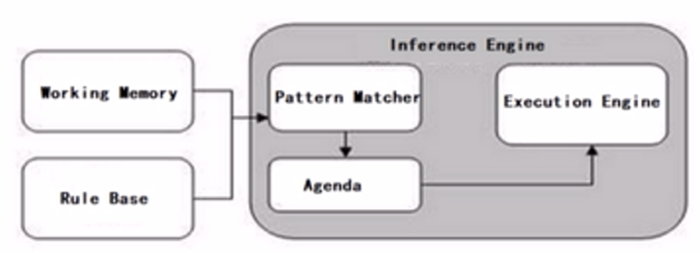
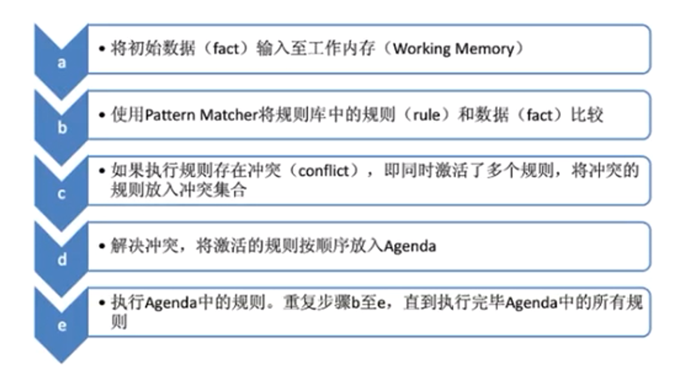
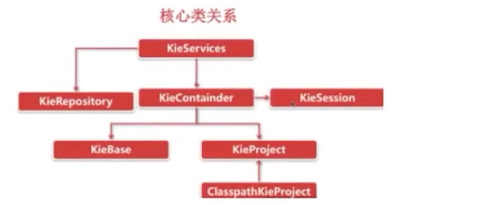
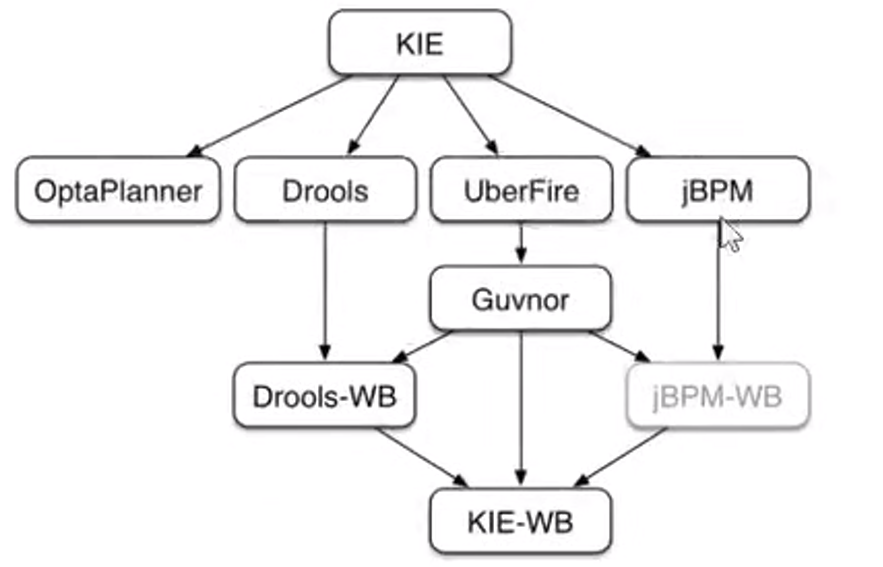
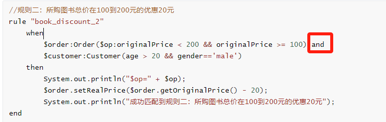

## 简介

什么是规则引擎

**规则引擎**，全称为**业务规则管理系统**，英文名为BRMS(即Business Rule Management System)。规则引擎的主要思想是将应用程序中的业务决策部分分离出来，并使用预定义的语义模块编写业务决策（业务规则），由用户或开发者在需要时进行配置、管理。

需要注意的是规则引擎并不是一个具体的技术框架，而是指的一类系统，即业务规则管理系统。目前市面上具体的规则引擎产品有：drools、VisualRules、iLog等。

规则引擎实现了将业务决策从应用程序代码中分离出来，接收数据输入，解释业务规则，并根据业务规则做出业务决策。规则引擎其实就是一个输入输出平台。

## 一、项目demo

第一步：创建maven工程drools_quickstart并导入drools相关maven坐标

```xml
<dependency>
    <groupId>org.drools</groupId>
    <artifactId>drools-compiler</artifactId>
    <version>7.10.0.Final</version>
</dependency>
<dependency>
    <groupId>junit</groupId>
    <artifactId>junit</artifactId>
    <version>4.12</version>
</dependency>
```

第二步：根据drools要求创建resources/META-INF/kmodule.xml配置文件

```xml
<?xml version="1.0" encoding="UTF-8" ?>
<kmodule xmlns="http://www.drools.org/xsd/kmodule">
    <!--
        name:指定kbase的名称，可以任意，但是需要唯一
        packages:指定规则文件的目录，需要根据实际情况填写，否则无法加载到规则文件
        default:指定当前kbase是否为默认
    -->
    <kbase name="myKbase1" packages="rules" default="true">
        <!--
            name:指定ksession名称，可以任意，但是需要唯一
            default:指定当前session是否为默认
        -->
        <ksession name="ksession-rule" default="true"/>
    </kbase>
</kmodule>
```

注意：上面配置文件的名称和位置都是固定写法，不能更改

第三步：创建实体类Order

```java
package com.itheima.drools.entity;

/**
 * 订单
 */
package com.lzy.entity;

public class Order {
    private int amout;//订单金额
    private int score;//累计积分

    @Override
    public String toString() {
        return "Order{" +
                "amout=" + amout +
                ", score=" + score +
                '}';
    }

    public int getAmout() {
        return amout;
    }

    public void setAmout(int amout) {
        this.amout = amout;
    }

    public int getScore() {
        return score;
    }

    public void setScore(int score) {
        this.score = score;
    }
}
```


第四步：创建规则文件resources/rules/bookDiscount.drl

```java
package rules;

import com.lzy.entity.Order;

//100元以下，不积分
rule "score_1"
when
    $order:Order(amout<=100)
then
    $order.setScore(0);
    System.out.println("100元以下不积分");
end

//100-500元，加100分
rule "score_2"
when
    $order:Order(amout>100 && amout<=500)
then
    $order.setScore(100);
    System.out.println("100到500元，加100分");
end

//500-100元，加500分
rule "score_3"
when
    $order:Order(amout>500 && amout<=1000)
then
    $order.setScore(500);
    System.out.println("5000到1000元，加500分");
end

//大于1000元，加1000
rule "score_4"
when
    $order:Order(amout>1000)
then
    $order.setScore(1000);
    System.out.println("1000元以上，加1000分");
end
```


第五步：编写单元测试

```java
package com.lzy.test;

import com.lzy.entity.Order;
import org.eclipse.jdt.internal.compiler.ast.OR_OR_Expression;
import org.junit.Test;
import org.kie.api.KieBase;
import org.kie.api.KieServices;
import org.kie.api.runtime.KieContainer;
import org.kie.api.runtime.KieSession;

/**
 * step1:获取KieServices
 * step2:获取kieContainer
 * step3：kieSession
 * step4:Insert fact
 * step5:触发规则
 * step6：关闭KieSession
 */
public class TestDrools {

    @Test
    public void testDemo() {
        //step1: 拿到kieServices
        KieServices kieServices = KieServices.Factory.get();

        //step2：获取kieContainer
        KieContainer container = kieServices.getKieClasspathContainer();

        //step3：kieSession
        KieSession kieSession = container.newKieSession();

        //step4:Insert fact
        Order order = new Order();
        order.setAmout(320);
        kieSession.insert(order);

        //step5:触发规则
        kieSession.fireAllRules();

        //step6：关闭KieSession
        kieSession.dispose();
    }
}

```

## 二、原理和构成

是基于 rete 算法的规则引擎。

### 2.1 规则引擎构成

drools规则引擎由以下三部分构成：

- Working Memory（工作内存）
- Rule Base（规则库）
- Inference Engine（推理引擎）

其中Inference Engine（推理引擎）又包括：

- Pattern Matcher（匹配器）     具体匹配哪一个规则，由这个完成
- Agenda(议程)
- Execution Engine（执行引擎）

如下图所示：



### 2.2 相关概念说明

**Working Memory**：工作内存，drools规则引擎会从Working Memory中获取数据并和规则文件中定义的规则进行模式匹配，所以我们开发的应用程序只需要将我们的数据插入到Working Memory中即可，例如本案例中我们调用kieSession.insert(order)就是将order对象插入到了工作内存中。

**Fact**：事实，是指在drools 规则应用当中，将一个**普通的JavaBean插入到Working Memory后的对象**就是Fact对象，例如本案例中的Order对象就属于Fact对象。Fact对象是我们的应用和规则引擎进行数据交互的桥梁或通道。

**Rule Base**：规则库，我们在规则文件中定义的规则都会被加载到规则库中。

**Pattern Matcher**：匹配器，将Rule Base中的所有规则与Working Memory中的Fact对象进行模式匹配，匹配成功的规则将被激活并放入Agenda中。

**Agenda**：议程，用于存放通过匹配器进行模式匹配后被激活的规则。

**Execution Engine**：执行引擎，执行Agenda中被激活的规则。

### 2.3 规则引擎执行过程



### 2.4 KIE介绍

我们在操作Drools时经常使用的API以及它们之间的关系如下图：



通过上面的核心API可以发现，大部分类名都是以Kie开头。**Kie全称为Knowledge Is Everything**，即"知识就是一切"的缩写，是Jboss一系列项目的总称。如下图所示，Kie的主要模块有OptaPlanner、Drools、UberFire、jBPM。



通过上图可以看到，Drools是整个KIE项目中的一个组件，Drools中还包括一个Drools-WB的模块，它是一个可视化的规则编辑器。

## 三. Drools基础语法

### 3.1 规则文件构成

在使用Drools时非常重要的一个工作就是编写规则文件，通常规则文件的后缀为.drl。

**drl是Drools Rule Language的缩写**。在规则文件中编写具体的规则内容。

一套完整的规则文件内容构成如下：

| 关键字   | 描述                                                         |
| :------- | :----------------------------------------------------------- |
| package  | 包名，只限于逻辑上的管理，同一个包名下的查询或者函数可以直接调用 |
| import   | 用于导入类或者静态方法                                       |
| global   | 全局变量                                                     |
| function | 自定义函数                                                   |
| query    | 查询                                                         |
| rule end | 规则体                                                       |

Drools支持的规则文件，除了drl形式，还有Excel文件类型的。

### 3.2 规则体语法结构

规则体是规则文件内容中的重要组成部分，是进行业务规则判断、处理业务结果的部分。

规则体语法结构如下：

```java
rule "ruleName"
    attributes
    when
        LHS 
    then
        RHS
end
```

**rule**：关键字，表示规则开始，参数为规则的唯一名称。

**attributes**：规则属性，是rule与when之间的参数，为可选项。

**when**：关键字，后面跟规则的条件部分。

**LHS**(Left Hand Side)：是规则的条件部分的通用名称。它由零个或多个条件元素组成。**如果LHS为空，则它将被视为始终为true的条件元素**。  （左手边）

**then**：关键字，后面跟规则的结果部分。

**RHS**(Right Hand Side)：是规则的后果或行动部分的通用名称。 （右手边）

**end**：关键字，表示一个规则结束。


### 3.3 注释

在drl形式的规则文件中使用注释和Java类中使用注释一致，分为单行注释和多行注释。

单行注释用"//"进行标记，多行注释以"/*"开始，以"*/"结束。如下示例：

```drl
//规则rule1的注释，这是一个单行注释
rule "rule1"
    when
    then
        System.out.println("rule1触发");
end

/*
规则rule2的注释，
这是一个多行注释
*/
rule "rule2"
    when
    then
        System.out.println("rule2触发");
end
```

### 3.4 Pattern模式匹配

前面我们已经知道了Drools中的匹配器可以将Rule Base中的所有规则与Working Memory中的Fact对象进行模式匹配，那么我们就需要在规则体的LHS部分定义规则并进行模式匹配。LHS部分由一个或者多个条件组成，条件又称为pattern。

**pattern的语法结构为：绑定变量名:Object(Field约束)**

其中绑定变量名可以省略，通常绑定变量名的命名一般建议以$开始。如果定义了绑定变量名，就可以在规则体的RHS部分使用此绑定变量名来操作相应的Fact对象。Field约束部分是需要返回true或者false的0个或多个表达式。

例如：

```java
//100-500元，加100分
rule "score_2"
when
	//Order为类型约束，amout为属性约束
    $order:Order(amout>100 && amout<=500)
then
    $order.setScore(100);
    System.out.println("100到500元，加100分");
end
```

通过上面的例子我们可以知道，匹配的条件为：

1、工作内存中必须存在Order这种类型的Fact对象-----类型约束

2、Fact对象的amout属性值必须小于500------属性约束

3、Fact对象的amout属性值必须大于等于100------属性约束

以上条件必须同时满足当前规则才有可能被激活。


**绑定变量既可以用在对象上，也可以用在对象的属性上**。例如上面的例子可以改为：

```java
//100-500元，加100分
rule "score_2"
when
    $order:Order($op:amout>100 && amout<=500)
then
    System.out.println("$op=" + $op);
    $order.setScore(100);
    System.out.println("100到500元，加100分");
end
```

LHS部分还可以定义多个pattern，多个pattern之间可以使用and或者or进行连接，也可以不写，默认连接为and。

```java
//规则二：所购图书总价在100到200元的优惠20元
rule "book_discount_2"
    when
        $order:Order($op:originalPrice < 200 && originalPrice >= 100) and
        $customer:Customer(age > 20 && gender=='male')
    then
        System.out.println("$op=" + $op);
        $order.setRealPrice($order.getOriginalPrice() - 20);
        System.out.println("成功匹配到规则二：所购图书总价在100到200元的优惠20元");
end
```

and可以不写，默认是and，也可以换成or



###  3.5 比较操作符

Drools提供的比较操作符，如下表：

| 符号         | 说明                                                         |
| :----------- | :----------------------------------------------------------- |
| >            | 大于                                                         |
| <            | 小于                                                         |
| >=           | 大于等于                                                     |
| <=           | 小于等于                                                     |
| ==           | 等于                                                         |
| !=           | 不等于                                                       |
| contains     | 检查一个Fact对象的某个属性值是否包含一个指定的对象值         |
| not contains | 检查一个Fact对象的某个属性值是否不包含一个指定的对象值       |
| memberOf     | 判断一个Fact对象的某个属性是否在一个或多个集合中             |
| not memberOf | 判断一个Fact对象的某个属性是否不在一个或多个集合中           |
| matches      | 判断一个Fact对象的属性是否与提供的标准的Java正则表达式进行匹配 |
| not matches  | 判断一个Fact对象的属性是否不与提供的标准的Java正则表达式进行匹配 |

前6个比较操作符和Java中的完全相同，下面我们重点学习后6个比较操作符。

#### 3.5.1 语法

- **contains | not contains语法结构**

  Object(Field[Collection/Array] contains value)

  Object(Field[Collection/Array] not contains value)

- **memberOf | not memberOf语法结构**

  Object(field memberOf value[Collection/Array])

  Object(field not memberOf value[Collection/Array])

- **matches | not matches语法结构**

  Object(field matches "正则表达式")

  Object(field not matches "正则表达式")


contain是前面包含后面，memberOf是后面包含前面。

#### 3.5.2 操作步骤

第一步：创建实体类，用于测试比较操作符

```java
package com.lzy.entity;
import java.util.List;

/**
 * 实体类
 * 用于测试比较操作符
 */
public class ComparisonOperatorEntity {
    private String names;
    private List<String> list;

    public String getNames() {
        return names;
    }

    public void setNames(String names) {
        this.names = names;
    }

    public List<String> getList() {
        return list;
    }

    public void setList(List<String> list) {
        this.list = list;
    }
}
```

第二步：在/resources/rules下创建规则文件comparisonOperator.drl

```drl
package ComparisonOperatorEntity;

import com.lzy.entity.ComparisonOperatorEntity;
/*
 当前规则文件用于测试Drools提供的比较操作符
*/

//测试比较操作符contains
rule "rule_comparison_contains"
    when
        ComparisonOperatorEntity(names contains "张三")
        ComparisonOperatorEntity(list contains names)
    then
        System.out.println("规则rule_comparison_contains触发");
end

//测试比较操作符not contains
rule "rule_comparison_notContains"
    when
        ComparisonOperatorEntity(names not contains "张三")
        ComparisonOperatorEntity(list not contains names)
    then
        System.out.println("规则rule_comparison_notContains触发");
end

//测试比较操作符memberOf
rule "rule_comparison_memberOf"
    when
        ComparisonOperatorEntity(names memberOf list)
    then
        System.out.println("规则rule_comparison_memberOf触发");
end

//测试比较操作符not memberOf
rule "rule_comparison_notMemberOf"
    when
        ComparisonOperatorEntity(names not memberOf list)
    then
        System.out.println("规则rule_comparison_notMemberOf触发");
end

//测试比较操作符matches
rule "rule_comparison_matches"
    when
        ComparisonOperatorEntity(names matches "张.*")
    then
        System.out.println("规则rule_comparison_matches触发");
end

//测试比较操作符not matches
rule "rule_comparison_notMatches"
    when
        ComparisonOperatorEntity(names not matches "张.*")
    then
        System.out.println("规则rule_comparison_notMatches触发");
end
```


第三步：编写单元测试

```java
 //测试比较操作符
    @Test
    public void test3(){
        KieServices kieServices = KieServices.Factory.get();
        KieContainer kieClasspathContainer = kieServices.getKieClasspathContainer();
        KieSession kieSession = kieClasspathContainer.newKieSession();

        ComparisonOperatorEntity comparisonOperatorEntity = new ComparisonOperatorEntity();
        comparisonOperatorEntity.setNames("张三");
        List<String> list = new ArrayList<String>();
        list.add("张三");
        list.add("李四");
        comparisonOperatorEntity.setList(list);

        //将数据提供给规则引擎，规则引擎会根据提供的数据进行规则匹配，如果规则匹配成功则执行规则
        kieSession.insert(comparisonOperatorEntity);

        //通过规则过滤器实现只执行指定规则
        kieSession.fireAllRules(new RuleNameEqualsAgendaFilter("rule_comparison_memberOf"));

        //执行所有的规则
//        kieSession.fireAllRules();
        kieSession.dispose();
    }
```

### 3.6 关键字

Drools的关键字分为：硬关键字(Hard keywords)和软关键字(Soft keywords)。

**硬关键字是我们在规则文件中定义包名或者规则名时明确不能使用的，否则程序会报错**。软关键字虽然可以使用，但是不建议使用。

硬关键字包括：true false null

软关键字包括：lock-on-active date-effective date-expires no-loop auto-focus activation-group agenda-group ruleflow-group entry-point duration package import dialect salience enabled attributes rule extend when then template query declare function global eval not in or and exists forall accumulate collect from action reverse result end over init

```java、、
比如：
rule true  //不可以
rule "true"  //可以
```

### 3.7 Drools内置方法

规则文件的`RHS`部分的主要作用是通过**插入，删除或修改工作内存中的Fact数据**，来达到控制规则引擎执行的目的。Drools提供了一些方法可以用来操作工作内存中的数据，**操作完成后规则引擎会重新进行相关规则的匹配，**原来没有匹配成功的规则在我们修改数据完成后有可能就会匹配成功了。

创建如下实体类：

```java
package com.lzy.entity;

/**
 * 学生
 */
public class Student {
    private int id;
    private String name;
    private int age;

    public int getId() {
        return id;
    }

    public void setId(int id) {
        this.id = id;
    }

    public String getName() {
        return name;
    }

    public void setName(String name) {
        this.name = name;
    }

    public int getAge() {
        return age;
    }

    public void setAge(int age) {
        this.age = age;
    }
}
```


#### 4.8.1 update方法

**update方法的作用是更新工作内存中的数据，并让相关的规则重新匹配。**   （要避免死循环）

第一步：编写规则文件/resources/rules/student.drl，文件内容如

```java
package student
import com.lzy.entity.Student

/*
 当前规则文件用于测试Drools提供的内置方法
*/

rule "rule_student_age小于10岁"
    when
        $s:Student(age < 10)
    then
        $s.setAge(15);
        update($s);//更新数据，导致相关的规则会重新匹配
        System.out.println("规则rule_student_age小于10岁触发");
end

rule "rule_student_age小于20岁同时大于10岁"
    when
        $s:Student(age < 20 && age > 10)
    then
        $s.setAge(25);
        update($s);//更新数据，导致相关的规则会重新匹配
        System.out.println("规则rule_student_age小于20岁同时大于10岁触发");
end

rule "rule_student_age大于20岁"
    when
        $s:Student(age > 20)
    then
        System.out.println("规则rule_student_age大于20岁触发");
end
```


第二步：编写单元测试

```
KieServices kieServices = KieServices.Factory.get();
KieContainer kieClasspathContainer = kieServices.getKieClasspathContainer();
KieSession kieSession = kieClasspathContainer.newKieSession();

Student student = new Student();
student.setAge(5);

//将数据提供给规则引擎，规则引擎会根据提供的数据进行规则匹配，如果规则匹配成功则执行规则
kieSession.insert(student);

kieSession.fireAllRules();
kieSession.dispose();
```


通过控制台的输出可以看到规则文件中定义的三个规则都触发了。

在更新数据时需要注意防止发生死循环。

#### 4.8.2 insert方法

insert方法的作用是向工作内存中插入数据，并让相关的规则重新匹配。

第一步：修改student.drl文件内容如下

```
package student
import com.lzy.entity.Student

/*
 当前规则文件用于测试Drools提供的内置方法
*/

rule "rule_student_age等于10岁"
    when
        $s:Student(age == 10)
    then
        Student student = new Student();
        student.setAge(5);
        insert(student);//插入数据，导致相关的规则会重新匹配
        System.out.println("规则rule_student_age等于10岁触发");
end

rule "rule_student_age小于10岁"
    when
        $s:Student(age < 10)
    then
        $s.setAge(15);
        update($s);
        System.out.println("规则rule_student_age小于10岁触发");
end

rule "rule_student_age小于20岁同时大于10岁"
    when
        $s:Student(age < 20 && age > 10)
    then
        $s.setAge(25);
        update($s);
        System.out.println("规则rule_student_age小于20岁同时大于10岁触发");
end

rule "rule_student_age大于20岁"
    when
        $s:Student(age > 20)
    then
        System.out.println("规则rule_student_age大于20岁触发");
end
```


第二步：编写单元测试

```java
KieServices kieServices = KieServices.Factory.get();
KieContainer kieClasspathContainer = kieServices.getKieClasspathContainer();
KieSession kieSession = kieClasspathContainer.newKieSession();

Student student = new Student();
student.setAge(10);

//将数据提供给规则引擎，规则引擎会根据提供的数据进行规则匹配，如果规则匹配成功则执行规则
kieSession.insert(student);

kieSession.fireAllRules();
kieSession.dispose();
```


通过控制台输出可以发现，四个规则都触发了，这是因为首先进行规则匹配时只有第一个规则可以匹配成功，但是在第一个规则中向工作内存中插入了一个数据导致重新进行规则匹配，此时第二个规则可以匹配成功。在第二个规则中进行了数据修改导致第三个规则也可以匹配成功，以此类推最终四个规则都匹配成功并执行了。

#### 4.8.3 retract方法

**retract方法的作用是删除工作内存中的数据，并让相关的规则重新匹配。**

第一步：修改student.drl文件内容如下

```java
package student
import com.lzy.entity.Student

/*
 当前规则文件用于测试Drools提供的内置方法
*/

rule "rule_student_age等于10岁时删除数据"
    /*
    salience：设置当前规则的执行优先级，数值越大越优先执行，默认值为0.
    因为当前规则的匹配条件和下面规则的匹配条件相同，为了保证先执行当前规则，需要设置优先级
    */
    salience 100 
    when
        $s:Student(age == 10)
    then
        retract($s);//retract方法的作用是删除工作内存中的数据，并让相关的规则重新匹配。
        System.out.println("规则rule_student_age等于10岁时删除数据触发");
end

rule "rule_student_age等于10岁"
    when
        $s:Student(age == 10)
    then
        Student student = new Student();
        student.setAge(5);
        insert(student);
        System.out.println("规则rule_student_age等于10岁触发");
end

rule "rule_student_age小于10岁"
    when
        $s:Student(age < 10)
    then
        $s.setAge(15);
        update($s);
        System.out.println("规则rule_student_age小于10岁触发");
end

rule "rule_student_age小于20岁同时大于10岁"
    when
        $s:Student(age < 20 && age > 10)
    then
        $s.setAge(25);
        update($s);
        System.out.println("规则rule_student_age小于20岁同时大于10岁触发");
end

rule "rule_student_age大于20岁"
    when
        $s:Student(age > 20)
    then
        System.out.println("规则rule_student_age大于20岁触发");
end
```


第二步：编写单元测试

```java
KieServices kieServices = KieServices.Factory.get();
KieContainer kieClasspathContainer = kieServices.getKieClasspathContainer();
KieSession kieSession = kieClasspathContainer.newKieSession();

Student student = new Student();
student.setAge(10);

//将数据提供给规则引擎，规则引擎会根据提供的数据进行规则匹配，如果规则匹配成功则执行规则
kieSession.insert(student);

kieSession.fireAllRules();
kieSession.dispose();
```


通过控制台输出可以发现，只有第一个规则触发了，因为在第一个规则中将工作内存中的数据删除了导致第二个规则并没有匹配成功。